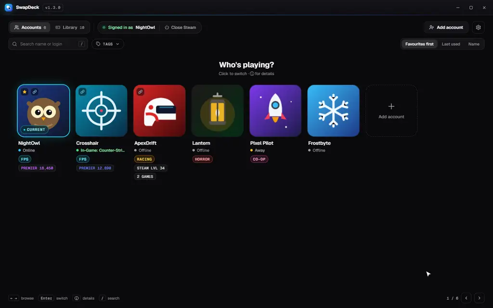
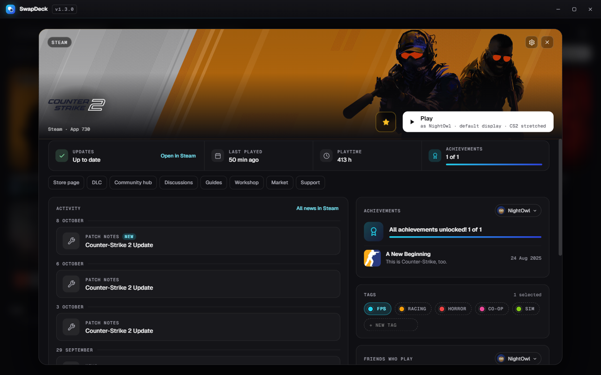
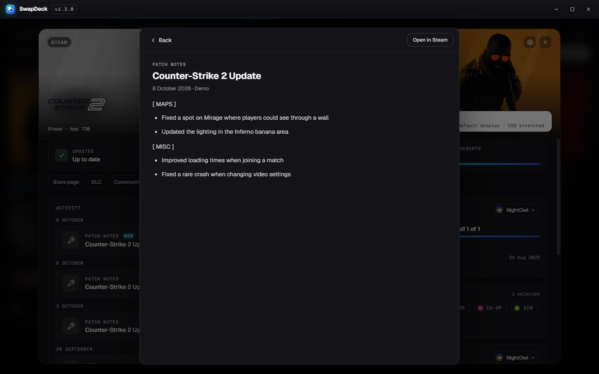

<div align="center">


# SwapDeck

**Switch Steam accounts in one click, and launch every game with the right account, monitor, resolution and sound.**<br>
Built for people who keep separate FPS, sim racing and horror accounts, with a Steam-style page for every game.

[](https://github.com/byteminite/SwapDeck/releases/latest) [](https://github.com/byteminite/SwapDeck/releases)  [](LICENSE) [](#how-its-made) [](https://munderdiffl.in/)

### [⬇ Download the latest release](https://github.com/byteminite/SwapDeck/releases/latest) · [▶ Try it in your browser](https://byteminite.github.io/SwapDeck/)

</div>

https://github.com/user-attachments/assets/4ff0eb41-04a6-4f8b-8f18-f7677fd23927

## Why SwapDeck

<table>
  <tr>
    <td width="25%" valign="top" align="center"><h3>🔁</h3><b>One click to switch</b><br><sub>Every account saved in Steam. No retyping passwords, no Steam Guard codes.</sub></td>
    <td width="25%" valign="top" align="center"><h3>🎮</h3><b>Play does the setup</b><br><sub>The right account, monitor, resolution, sound and apps, then the game.</sub></td>
    <td width="25%" valign="top" align="center"><h3>↩️</h3><b>Everything goes back</b><br><sub>Your normal setup returns when the game exits. Stop never closes your game.</sub></td>
    <td width="25%" valign="top" align="center"><h3>🔒</h3><b>Stays on your PC</b><br><sub>No sign-up, no telemetry. Stats and friends are optional and encrypted by Windows.</sub></td>
  </tr>
</table>

## Features

<div align="center">

<picture>
  <source media="(prefers-color-scheme: light)" srcset="docs/demo-light.webp">
  
</picture>

<sub>The real app: switch account in one click, find a game with tags, read its patch notes, then Play sets up the monitor, sound and apps</sub>

</div>

<table>
<tr>
<td width="55%"></td>
<td width="45%" valign="middle">
<h3>👥 Accounts, sorted your way</h3>
<ul>
<li>One-click switching from a <b>"Who's playing?"</b> picker or the classic sideways gallery</li>
<li><b>Tags, notes and favourites</b>: give each tag its own colour, then tick as many tags as you like in the <b>Tags</b> filter</li>
<li><b>Status at a glance</b>: online / in-game, VAC and trade bans, limited accounts</li>
<li><b>Playtime per account</b> for everything you launch through SwapDeck</li>
<li>Add and forget accounts without digging through Steam</li>
</ul>
</td>
</tr>
<tr>
<td width="45%" valign="middle">
<h3>📚 One library for everything</h3>
<ul>
<li>Your installed <b>Steam games</b> with their own Steam artwork</li>
<li>Any <b>non-Steam game</b>: if it has an <code>.exe</code>, it fits</li>
<li>Each game remembers <b>which account</b> plays it, so Play switches for you</li>
<li><b>Tag and star games</b>: favourites come first, whatever the sort</li>
<li><b>Update badges</b> on the covers: <i>Update queued</i>, <i>Updating 42%</i> or <i>Update failed</i>, straight from Steam</li>
<li><b>Desktop shortcuts</b> that launch through SwapDeck with all your settings</li>
</ul>
</td>
<td width="55%"></td>
</tr>
<tr>
<td width="55%"></td>
<td width="45%" valign="middle">
<h3>🎮 A Steam-style page for every game</h3>
<ul>
<li><b>Update status</b> from Steam: up to date, downloading with progress, paused or failed</li>
<li><b>Last played, playtime and achievements</b> at a glance, per account</li>
<li><b>Screenshots</b>, <b>workshop</b> items and <b>DLC</b>, with one-click links to the store, hub, guides and more</li>
<li><b>Friends who play</b> it, and which DLC the account owns (for accounts connected for stats)</li>
<li>A <b>note</b> for each game: a crosshair code, a server IP…</li>
</ul>
</td>
</tr>
<tr>
<td width="45%" valign="middle">
<h3>📰 Patch notes, right in SwapDeck</h3>
<ul>
<li>The developer's <b>announcements and patch notes</b>, newest first</li>
<li><b>Read the whole post</b> in the app, with headings, lists and pictures</li>
<li>Posts since you last played are tagged <b>New</b></li>
<li>Steam links open in Steam, trailers on YouTube, and <i>Open in Steam</i> is always there</li>
</ul>
</td>
<td width="55%"></td>
</tr>
<tr>
<td width="55%"></td>
<td width="45%" valign="middle">
<h3>🎯 Per-game setup</h3>
<ul>
<li><b>Display</b>: make a monitor primary, or use only that one (even if it's off in Windows)</li>
<li><b>Resolution profiles</b> you make yourself, like 1280 × 960 stretched for CS2</li>
<li><b>Sound device</b> per game, e.g. your headset</li>
<li><b>Launch options</b>, or import the ones you already set in Steam</li>
<li>Your <b>note on the launch screen</b> when you press Play, with a <i>Copy</i> button</li>
<li>Everything is <b>put back</b> when the game exits. It's all behind the ⚙️ gear on the game's page</li>
</ul>
</td>
</tr>
<tr>
<td width="45%" valign="middle">
<h3>🏁 Made for sim racing</h3>
<ul>
<li><b>Companion apps</b> start with the game: SimHub, Crew Chief, wheel software…</li>
<li>Tick <b>"Close when the game exits"</b> for the ones that should go with it</li>
<li>Start a <b>custom launcher</b> such as Content Manager, and keep the Steam art and tracking</li>
<li>Put the game on your <b>ultrawide only</b>, then get your normal desk back afterwards</li>
</ul>
</td>
<td width="55%"></td>
</tr>
<tr>
<td width="55%"></td>
<td width="45%" valign="middle">
<h3>🖥️ Your monitors, drawn to scale</h3>
<ul>
<li>Every monitor that's plugged in, <b>including ones switched off</b> in Windows</li>
<li>Pick the ones you use day to day and your main one</li>
<li>Windows' own layout is saved and restored, <b>rotation included</b></li>
<li><b>Restore display now</b> if a game ever crashes</li>
</ul>
</td>
</tr>
<tr>
<td width="45%" valign="middle">
<h3>📊 Stats, if you want them</h3>
<ul>
<li><b>Connect for stats</b> with Steam's own sign-in (QR code, password or token)</li>
<li>CS2 <b>Premier rating</b>, Competitive and Wingman ranks, level and medals</li>
<li>Games and hours, Steam level, wallet balance and friends</li>
<li><b>Friends who play</b> each game, with their hours, and which of its DLC the account owns</li>
<li>Completely optional. Switching works without it</li>
</ul>
</td>
<td width="55%"></td>
</tr>
<tr>
<td width="55%"></td>
<td width="45%" valign="middle">
<h3>🎨 Make it yours</h3>
<ul>
<li><b>Dark, OLED Black or Light</b>, with accent colours or your Windows accent</li>
<li>The accent can <b>follow the running game's tag</b></li>
<li>Choose the <b>grid or gallery</b> accounts layout, and whether SwapDeck opens on Accounts or Library</li>
<li><b>Auto UI scale</b> that fits 1080p, 1440p and 4K screens (a bigger window shows more, not bigger), or pick 80% to 150%</li>
</ul>
</td>
</tr>
</table>

<sub>Screenshots use made-up demo accounts.</sub>

### And a lot more

<table>
  <tr>
    <td width="33%" valign="top">🧭 <b>Tray panel</b><br><sub>Switch accounts or start a recent game from the taskbar, with update status for each game</sub></td>
    <td width="33%" valign="top">⌨️ <b>Tray shortcut</b><br><sub>Open the tray panel from any app with <code>Ctrl + Alt + S</code>. Off by default, key of your choice</sub></td>
    <td width="33%" valign="top">🎮 <b>Controller support</b><br><sub>D-pad, A / B / X, and LB / RB to change tabs</sub></td>
  </tr>
  <tr>
    <td width="33%" valign="top">💾 <b>Backup & restore</b><br><sub>Tags, notes, games and profiles. Never sign-ins</sub></td>
    <td width="33%" valign="top">🔐 <b>Master password</b><br><sub>A lock screen on top of Windows' encryption</sub></td>
    <td width="33%" valign="top">🕹️ <b>Per-account CS2 configs</b><br><sub>Copy settings between accounts, plus an autoexec each</sub></td>
  </tr>
  <tr>
    <td width="33%" valign="top">🕓 <b>Session history</b><br><sub>Who played what, when, and for how long</sub></td>
    <td width="33%" valign="top">✨ <b>Updates itself</b><br><sub>Quietly, with a What's new after each update</sub></td>
    <td width="33%" valign="top">⌨️ <b>Keyboard friendly</b><br><sub>Arrows, Enter and <code>/</code> to search</sub></td>
  </tr>
  <tr>
    <td width="33%" valign="top">🚀 <b>Start with Windows</b><br><sub>Optionally straight to the tray</sub></td>
    <td width="33%" valign="top">⭐ <b>Favourites</b><br><sub>Star accounts and games, and they come first</sub></td>
    <td width="33%" valign="top">🏆 <b>Achievements per account</b><br><sub>Latest unlocks and progress, from Steam's files on your PC. Hidden ones stay hidden</sub></td>
  </tr>
</table>

## Install

| File | |
|---|---|
| `SwapDeck-Setup-x.y.z.exe` | Installer (recommended). No admin needed, and it **updates itself**. |
| `SwapDeck-x.y.z-portable.exe` | Single file, no install. Doesn't auto-update. |

> [!NOTE]
> The app isn't code-signed yet, so Windows may show a SmartScreen warning the first time. Click **More info → Run anyway**.

## Using it

| Action | How |
|---|---|
| Switch account | Click a card (grid) or double-click a panel (gallery), or select it and press `Enter` |
| Account details | `ⓘ` on a card, or right-click |
| Play a game | Library → hover a game → Play, or double-click |
| Game page | Click a game in the Library. The ⚙️ gear next to the close button opens its setup |
| Read patch notes | A game's page → Activity → click a post |
| Tray panel from anywhere | `Ctrl + Alt + S` (turn it on in Settings → General) |
| Move around | Arrow keys, or a controller's d-pad / stick |
| Controller | `A` select · `B` back · `X` details · `LB`/`RB` switch Accounts ↔ Library |
| Search | `/` |
| UI scale | `Ctrl +` / `Ctrl −` / `Ctrl 0` (auto), or Settings |

## Privacy

- Everything stays on your PC, in `%APPDATA%\SwapDeck`.
- **Connecting for stats is optional.** It uses Steam's own sign-in (QR code, password + Steam Guard, or a token you paste).
  SwapDeck keeps Steam's sign-in token, encrypted by Windows. Your password is stored only if you tick "Remember", also encrypted.
- Add a **master password** in Settings → Security for a lock screen on top of Windows' encryption.
- Disconnecting deletes the token. You can also revoke the "SwapDeck" device in your Steam account settings.
- Backups contain your tags, notes, games and profiles, never sign-ins or passwords.
- A game's details read Steam's own files on your PC for update status, screenshots and achievements. Its news and
  DLC list come from Steam's public servers (no sign-in), only when you open that game, and are cached for a while.
- For accounts connected for stats, a game's details also show friends who play it and which DLC the account owns. That
  uses the account's saved Steam sign-in (the same one Refresh stats uses), only when you open the game, and talks only to Steam.

## FAQ

<details>
<summary><b>Can SwapDeck get me VAC banned?</b></summary>

No. SwapDeck never touches a running game: it doesn't inject anything, read game memory or change game files while you play.
Switching only changes which saved login Steam starts with, the same as picking an account in Steam yourself.
The only game files it ever writes are CS2 config files, and only when you ask: your per-account autoexec, or copying settings from one account to another.

</details>

<details>
<summary><b>Does it close my game when I press Stop?</b></summary>

Never. Stop puts your display and sound back and stops tracking playtime. The game keeps running.

</details>

<details>
<summary><b>Where are my logins kept?</b></summary>

Steam keeps them, like it always does. SwapDeck only tells Steam which saved account to start with.
If you connect an account for stats, Steam's sign-in token is stored encrypted by Windows. See [Privacy](#privacy).

</details>

<details>
<summary><b>Why does Windows warn me when I run the installer?</b></summary>

The app isn't code-signed yet, so SmartScreen doesn't recognise it. Click <b>More info → Run anyway</b>. The full source is right here.

</details>

<details>
<summary><b>My screens are wrong after a game crashed. How do I fix them?</b></summary>

Open Settings → Displays → <b>Restore display now</b>. If you can't see SwapDeck, press <code>Win + P</code> → Extend first.

</details>

## Good to know

- Steam's **"Ask which account to use each time Steam starts"** blocks automatic sign-in, so SwapDeck turns it off when you switch.
- If Steam asks for a password after a switch, that account's saved login expired. Sign in once with **Remember me** ticked.
- CS2 stats aren't refreshed while that account is in a game, because it would kick the game session.
- A game's **news, DLC and friends** load when you open its page and are cached for a while, so the first open takes a second.
- **Monitors** only need to be plugged in and powered. SwapDeck can switch one on that's turned off in Windows.
- **Resolution profiles** can only use sizes your graphics driver offers. For stretched 4:3, add the resolution as a custom
  resolution in AMD Software or the NVIDIA Control Panel, and set scaling to Full panel / Full-screen. The **Test** button
  in Settings → Displays tells you if Windows accepts it.

## Development

```bash
npm install
npm run dev     # run from source with its own test profile (your real settings stay untouched)
npm start       # run from source with your normal settings
npm run dist    # build installer + portable exe into dist\
```

**Releasing an update:** bump `version` in `package.json`, add the release to `src/renderer/changelog.js`, run `npm run dist`,
then publish a GitHub release (tag `vX.Y.Z`) with `SwapDeck-Setup-X.Y.Z.exe`, its `.blockmap` and `latest.yml`.
Installed copies pick it up automatically. Drafts are ignored.

## How it's made

SwapDeck is vibe coded: it was designed, directed and tested by me ([@byteminite](https://github.com/byteminite)), and the code was
written by **Claude**, Anthropic's AI, using [Claude Code](https://claude.com/claude-code) running in
[Munder Difflin](https://munderdiffl.in/), a free, open source multi-agent harness. That includes the app, the native display
and sound helpers, the browser demo, this README and the promo video. Every feature was tried on a real setup (multiple
accounts, three monitors, sim racing gear) before it shipped, and the full source is here for anyone to read.

## License

[MIT](LICENSE)
