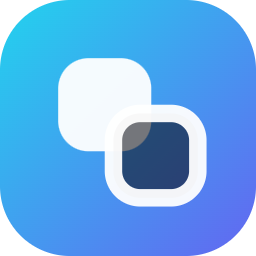
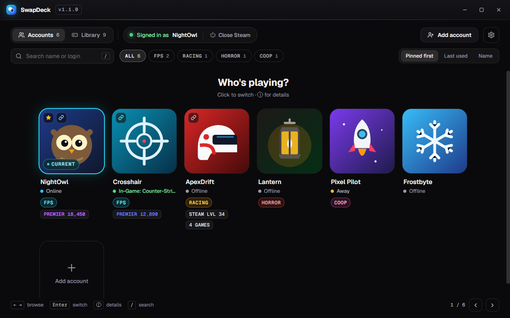
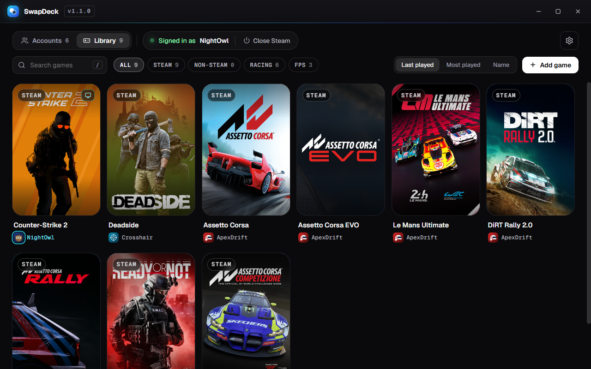
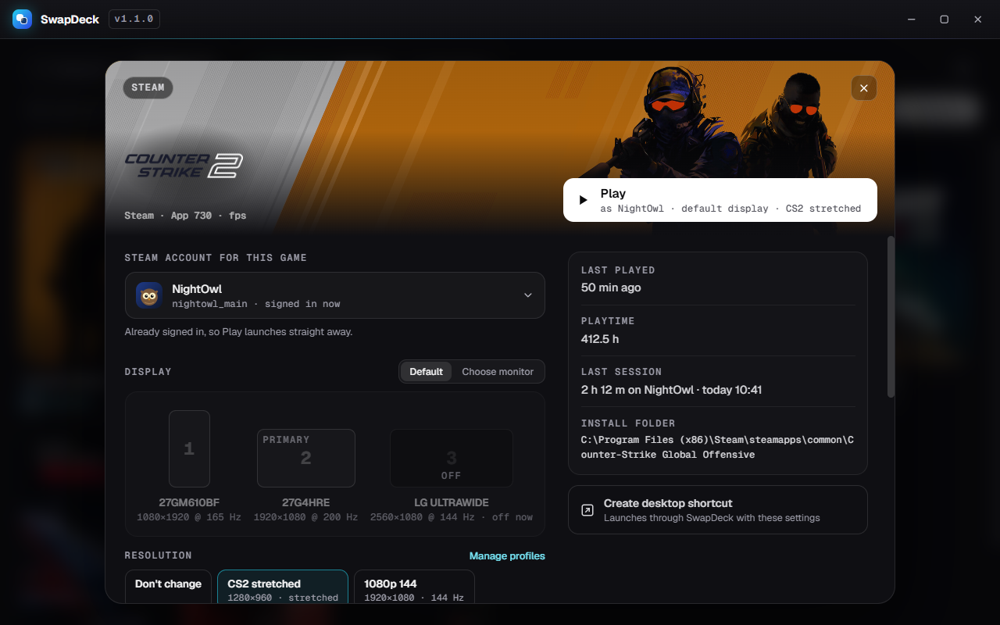
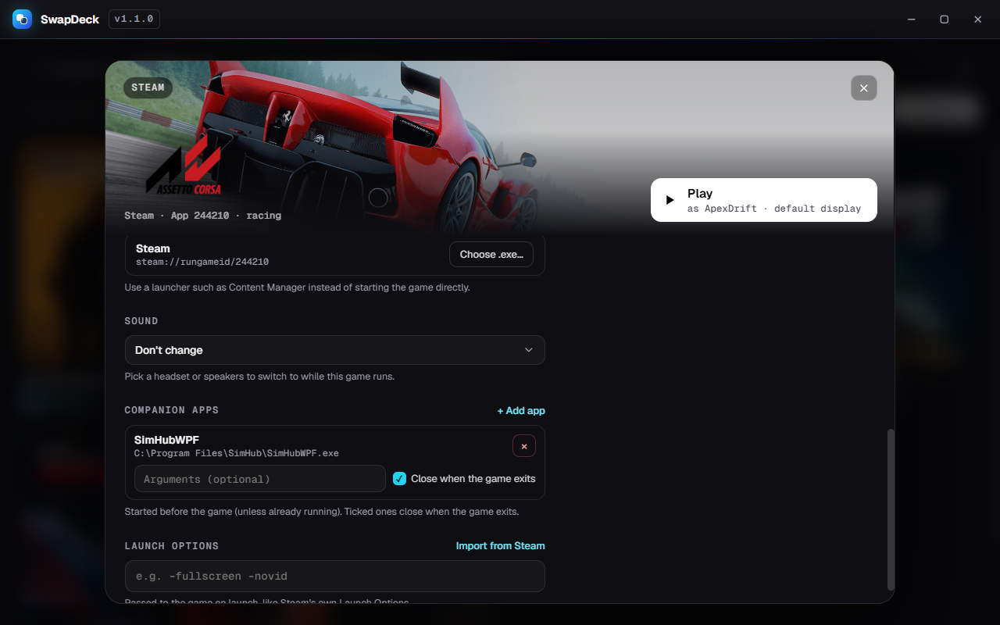
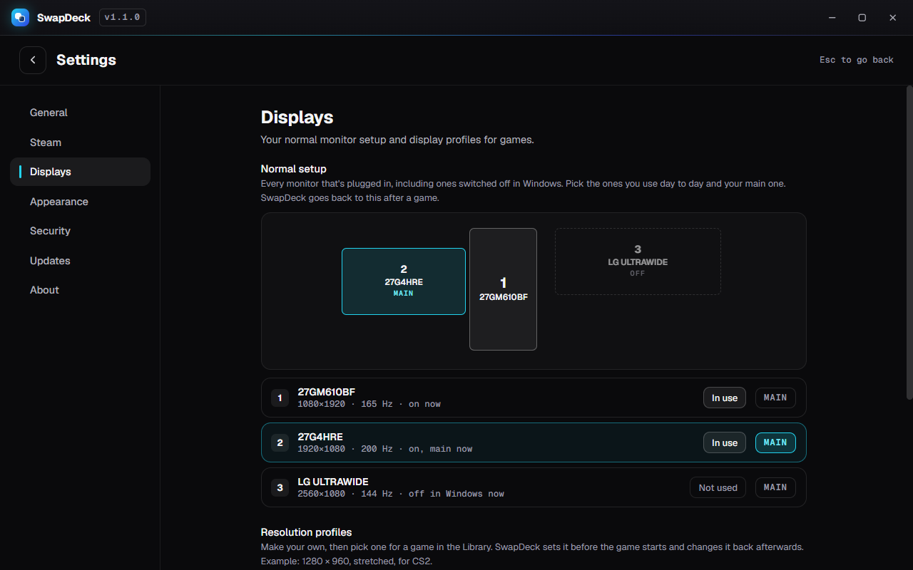
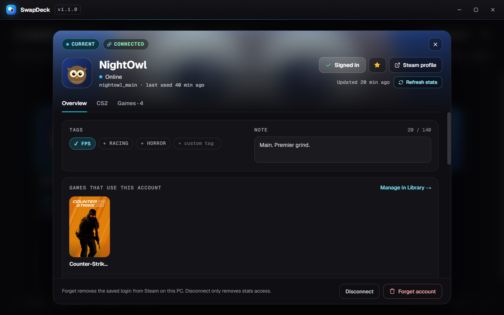
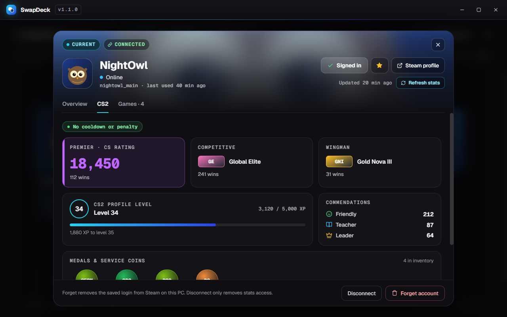
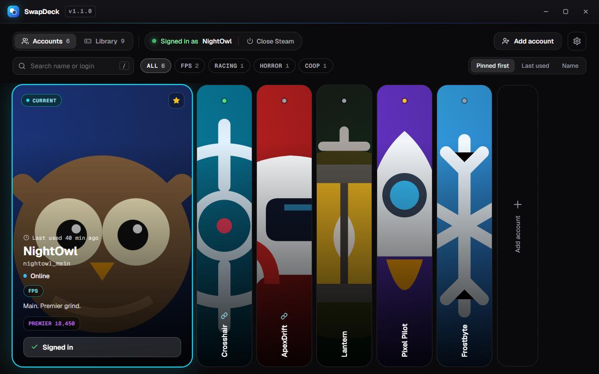
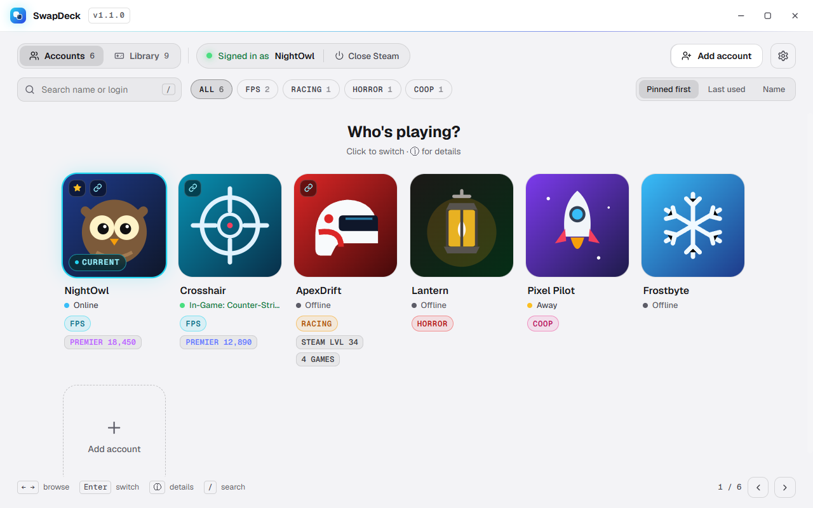

<div align="center">



# SwapDeck

**Switch Steam accounts in one click, and launch every game with the right account, monitor, resolution and sound.**<br>
Built for people who keep separate FPS, sim racing and horror accounts.

[](https://github.com/byteminite/SwapDeck/releases/latest) [](https://github.com/byteminite/SwapDeck/releases)  [](LICENSE)

### [⬇ Download the latest release](https://github.com/byteminite/SwapDeck/releases/latest)



</div>

## Screenshots

<table>
  <tr>
    <td width="50%" valign="top"><br><b>Library</b><br><sub>Your Steam games with their own art, plus any .exe</sub></td>
    <td width="50%" valign="top"><br><b>Per-game setup</b><br><sub>Account, monitor and a stretched resolution for CS2</sub></td>
  </tr>
  <tr>
    <td width="50%" valign="top"><br><b>Sim racing</b><br><sub>SimHub starts with the game and closes after it</sub></td>
    <td width="50%" valign="top"><br><b>Displays</b><br><sub>Your normal setup, drawn to scale, even monitors that are off</sub></td>
  </tr>
  <tr>
    <td width="50%" valign="top"><br><b>Account details</b><br><sub>Tags, notes and the games that use the account</sub></td>
    <td width="50%" valign="top"><br><b>CS2 stats</b><br><sub>Premier, ranks, level and medals (optional)</sub></td>
  </tr>
  <tr>
    <td width="50%" valign="top"><br><b>Gallery layout</b><br><sub>The classic sideways panels, if you prefer them</sub></td>
    <td width="50%" valign="top"><br><b>Themes</b><br><sub>Dark, OLED Black or Light, with any accent colour</sub></td>
  </tr>
</table>

<sub>Screenshots use made-up demo accounts.</sub>

## Why SwapDeck

- 🔁 **One click to switch** between every account saved in Steam. No retyping passwords, no Steam Guard codes.
- 🎮 **Play does the setup.** Pick a game and SwapDeck signs in the right account, sets your monitor, resolution and sound, starts your companion apps, then launches it.
- ↩️ **Everything goes back** when the game exits. Stop never closes your game.
- 🔒 **Stays on your PC.** No accounts, no telemetry. Stats are optional.

## Install

| File | |
|---|---|
| `SwapDeck-Setup-x.y.z.exe` | Installer (recommended). No admin needed, and it **updates itself**. |
| `SwapDeck-x.y.z-portable.exe` | Single file, no install. Doesn't auto-update. |

> [!NOTE]
> The app isn't code-signed yet, so Windows may show a SmartScreen warning the first time. Click **More info → Run anyway**.

## Features

<details open>
<summary><b>Accounts</b></summary>

- **One-click switching**: a "Who's playing?" picker, or the classic sideways gallery
- **Tags, notes and pins**, plus search, tag filters and sorting
- **Status at a glance**: online / in-game, VAC and trade bans, limited account
- **Optional stats** ("Connect for stats"): games and hours, Steam level, wallet, CS2 Premier rating, ranks and medals
- **Playtime per account** for games you launch through SwapDeck
- **Add and forget accounts** without digging through Steam

</details>

<details open>
<summary><b>Library</b></summary>

- Your installed **Steam games**, with their Steam artwork, plus any **non-Steam game** (anything with an `.exe`)
- Each game can have its own:
  - **Steam account**: Play switches to it first
  - **Display**: make a monitor primary, or use only that monitor (it can even be switched off in Windows)
  - **Resolution profile** you make yourself, e.g. 1280 × 960 stretched for CS2
  - **Sound device**: e.g. your headset for sim racing
  - **Companion apps** started with the game (SimHub, Crew Chief, wheel software…) and optionally closed afterwards
  - **Launcher**: start a tool such as Content Manager instead of the game, and keep the Steam art and tracking
  - **Launch options**, or import the ones you already set in Steam
- **Desktop shortcuts** that launch a game through SwapDeck with all of the above

</details>

<details open>
<summary><b>App</b></summary>

- **Themes**: Dark, OLED Black, Light, with accent colours (or your Windows accent)
- **Tray mode** with a quick panel to switch accounts or start a recent game, and **Start with Windows**
- **Displays**: your normal monitor setup, drawn to scale, with "Restore display now" if a game ever crashes
- **Backup and restore** of your settings (never sign-ins)
- **Keyboard and controller** navigation
- **Optional master password** with a lock screen
- **What's new** after every update, and the full changelog in Settings → About

</details>

## Using it

| Action | How |
|---|---|
| Switch account | Click a card (grid) or double-click a panel (gallery), or select it and press `Enter` |
| Account details | `ⓘ` on a card, or right-click |
| Play a game | Library → hover a game → Play, or double-click |
| Move around | Arrow keys, or a controller's d-pad / stick |
| Controller | `A` select · `B` back · `X` details · `LB`/`RB` switch Accounts ↔ Library |
| Search | `/` |
| UI scale | `Ctrl +` / `Ctrl −` / `Ctrl 0` (auto), or Settings |

## Privacy

- Everything stays on your PC, in `%APPDATA%\SwapDeck`.
- **Connecting for stats is optional.** It uses Steam's own sign-in (QR code, password + Steam Guard, or a token you paste).
  SwapDeck keeps Steam's sign-in token, encrypted by Windows. Your password is stored only if you tick "Remember", also encrypted.
- Add a **master password** in Settings → Security for a lock screen on top of Windows' encryption.
- Disconnecting deletes the token. You can also revoke the "SwapDeck" device in your Steam account settings.
- Backups contain your tags, notes, games and profiles, never sign-ins or passwords.

## Good to know

- Steam's **"Ask which account to use each time Steam starts"** blocks automatic sign-in, so SwapDeck turns it off when you switch.
- If Steam asks for a password after a switch, that account's saved login expired. Sign in once with **Remember me** ticked.
- CS2 stats aren't refreshed while that account is in a game, because it would kick the game session.
- **Monitors** only need to be plugged in and powered. SwapDeck can switch one on that's turned off in Windows.
- **Resolution profiles** can only use sizes your graphics driver offers. For stretched 4:3, add the resolution as a custom
  resolution in AMD Software or the NVIDIA Control Panel, and set scaling to Full panel / Full-screen. The **Test** button
  in Settings → Displays tells you if Windows accepts it.
- If your screens ever end up wrong after a crash, use **Restore display now** in Settings → Displays, or press `Win + P` → Extend.

## Development

```bash
npm install
npm start       # run from source
npm run dist    # build installer + portable exe into dist\
```

**Releasing an update:** bump `version` in `package.json`, add the release to `src/renderer/changelog.js`, run `npm run dist`,
then publish a GitHub release (tag `vX.Y.Z`) with `SwapDeck-Setup-X.Y.Z.exe`, its `.blockmap` and `latest.yml`.
Installed copies pick it up automatically. Drafts are ignored.

## License

[MIT](LICENSE)
